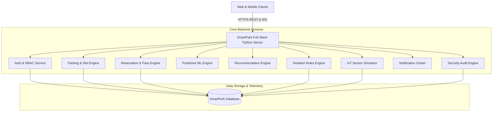

# SmartPark Platform — Full-Stack Architecture & Engineering Guide

SmartPark is an intelligent civic and corporate parking optimization platform designed to eliminate urban congestion, provide sub-second spot discovery, enforce corporate access policies, and predict future facility occupancy.

---

## 1. System Architecture Overview

---

## 2. Multi-Tiered Access Control Matrix

SmartPark enforces a 4-tier authorization matrix:

| Persona | Public Municipal Decks | Verified Corporate Decks (TCS, Infosys) | Restricted/VIP Decks | Admin Console (`/admin`) |
| :--- | :---: | :---: | :---: | :---: |
| **Anonymous / Logged Out** | View Preview Only (Booking Requires Login) | 🔒 Authentication Gate | 🔒 Authentication Gate | 🚫 Access Denied |
| **Public Citizen** (`rahul@gmail.com`) | ✅ Full Access & Booking | 🔒 No Corporate Clearance Notice | 🔒 Access Restricted | 🚫 Access Denied |
| **TCS Employee** (`demo@smartpark.com`) | ✅ Full Access & Booking | ✅ Authorized Access (TCS Decks) | ✅ Whitelisted Clearance | 🚫 Access Denied |
| **Infosys Employee** (`neha@infosys.com`)| ✅ Full Access & Booking | ✅ Authorized Access (Infosys Decks) | 🔒 Access Restricted | 🚫 Access Denied |
| **System Administrator** (`admin@smartpark.com`)| ✅ Full Access | ✅ Universal Clearance | ✅ Universal Clearance | 🛡️ Master Control Active |

---

## 3. Predictive Occupancy Engine (Statistical ML Formulation)

The prediction service forecasts arrival occupancy at $T + 10m$, $T + 20m$, $T + 30m$, and $T + 60m$ intervals by evaluating:

$$O_{predicted}(t + \Delta t) = O_{current} \times \left(1 + \alpha_{time} \cdot \beta_{rate} \cdot \sqrt{\frac{\Delta t}{60}}\right)$$

Where:
- $O_{current}$ = Current sensor-reported occupancy percentage.
- $\alpha_{time}$ = Time-of-day demand multiplier ($\approx 1.25$ during peak hours: 09:30–11:45 & 17:00–19:30).
- $\beta_{rate}$ = Recent rate of vehicle ingress/egress from ANPR barrier stud events.
- $\Delta t$ = Forward projection minutes (10, 20, 30, 60).

---

## 4. Multi-Factor Recommendation Scoring

The recommendation engine ranks facilities using a composite scoring model:

$$Score = W_{avail} \cdot \left(\frac{A_{vacant}}{A_{total}}\right) + W_{dist} \cdot \max(0, 1 - \frac{d}{10}) + W_{price} \cdot \max(0, 1 - \frac{P}{100}) + B_{corp}$$

Where:
- $W_{avail} = 40$ (Availability priority weight)
- $W_{dist} = 30$ (Distance in kilometers)
- $W_{price} = 15$ (Tariff competitiveness)
- $B_{corp} = 15$ (Corporate affiliation bonus)
