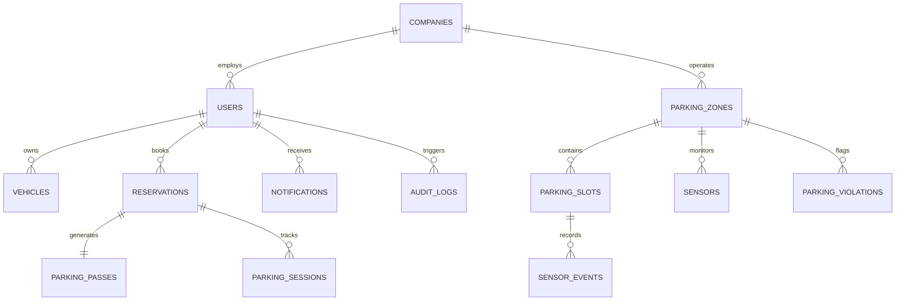

# SmartPark Platform — Database Schema & Relational Architecture

Comprehensive documentation of the SmartPark relational database layer, tables, foreign keys, and indexing strategy.

---

## 1. Table Definitions

### `users`
| Column | Type | Description |
| :--- | :--- | :--- |
| `id` | TEXT PRIMARY KEY | Unique user identifier (`usr-xxx`) |
| `name` | TEXT NOT NULL | Full name of user |
| `email` | TEXT UNIQUE NOT NULL | Normalized email address |
| `password_hash` | TEXT NOT NULL | Password hash / credential |
| `role` | TEXT DEFAULT 'USER' | Role (`USER`, `ADMIN`, `OPERATOR`) |
| `company_id` | TEXT | Linked corporate partner (`comp-tcs`, etc.) |
| `company_name` | TEXT | Name of company |
| `employee_id` | TEXT | Official badge ID (`TCS-1024`) |
| `company_verified`| INTEGER DEFAULT 0 | 1 if verified corporate employee |
| `private_parking_access`| TEXT | JSON Array of permitted zone IDs |

### `parking_zones`
| Column | Type | Description |
| :--- | :--- | :--- |
| `id` | TEXT PRIMARY KEY | Unique zone identifier (`zone-pub-01`, `zone-pvt-01`) |
| `zone_code` | TEXT NOT NULL | Short code (`PUB-01`, `PVT-01`) |
| `name` | TEXT NOT NULL | Human-readable facility title |
| `category` | TEXT DEFAULT 'PUBLIC' | `PUBLIC`, `PRIVATE_COMPANY`, `PRIVATE_RESTRICTED`, `VISITOR` |
| `total_spaces` | INTEGER NOT NULL | Total bays capacity |
| `available_spaces` | INTEGER NOT NULL | Current vacant bays |
| `occupied_spaces` | INTEGER DEFAULT 0 | Currently filled bays |
| `price_per_hour` | REAL DEFAULT 20.0 | Hourly tariff rate in ₹ |
| `access_type` | TEXT DEFAULT 'ALL_USERS' | Access enforcement rule |

### `parking_slots`
| Column | Type | Description |
| :--- | :--- | :--- |
| `id` | TEXT PRIMARY KEY | Slot identifier (`slot-mun-01`) |
| `zone_id` | TEXT NOT NULL | Foreign key to `parking_zones` |
| `slot_number` | TEXT NOT NULL | Bay label (`A-01`, `M-24`) |
| `floor_level` | TEXT DEFAULT 'G' | Level (`G`, `B1`, `B2`, `1`, `2`) |
| `slot_type` | TEXT DEFAULT 'STANDARD' | `STANDARD`, `EV_FAST_CHARGE`, `HANDICAPPED` |
| `status` | TEXT DEFAULT 'AVAILABLE' | `AVAILABLE`, `OCCUPIED`, `RESERVED`, `MAINTENANCE` |
| `current_vehicle_plate` | TEXT | Plate number of parked vehicle |
| `sensor_id` | TEXT | Linked IoT ground stud |

### `reservations`
| Column | Type | Description |
| :--- | :--- | :--- |
| `id` | TEXT PRIMARY KEY | Reservation token (`RES-A2401`) |
| `user_id` | TEXT NOT NULL | Booking owner |
| `parking_zone_id` | TEXT NOT NULL | Reserved facility |
| `slot_number` | TEXT NOT NULL | Bay number |
| `vehicle_plate` | TEXT NOT NULL | Registered vehicle license plate |
| `start_time` | TEXT | Booking start timestamp |
| `end_time` | TEXT | Booking expiration timestamp |
| `duration_hours` | REAL | Total hours booked |
| `total_amount` | REAL | Total tariff in ₹ |
| `payment_status` | TEXT | `PAID`, `PENDING`, `REFUNDED` |
| `status` | TEXT | `RESERVED`, `CHECKED_IN`, `COMPLETED`, `CANCELLED` |
| `qr_pass_token` | TEXT | Secure token for QR validation |

### `parking_violations`
| Column | Type | Description |
| :--- | :--- | :--- |
| `id` | TEXT PRIMARY KEY | Violation record (`V-1024`) |
| `vehicle_plate` | TEXT NOT NULL | Vehicle number |
| `violation_type` | TEXT NOT NULL | Breach classification |
| `severity` | TEXT DEFAULT 'MEDIUM' | `LOW`, `MEDIUM`, `HIGH`, `CRITICAL` |
| `fine_amount` | REAL DEFAULT 500.0 | Penalty in ₹ |
| `status` | TEXT DEFAULT 'OPEN' | `OPEN`, `UNDER_REVIEW`, `RESOLVED`, `DISMISSED` |
| `evidence_notes` | TEXT | Inspector notes / ANPR snapshot info |

---

## 2. High-Performance Indexing Strategy

1. `CREATE INDEX idx_users_email ON users(email);`
2. `CREATE INDEX idx_parking_category ON parking_zones(category);`
3. `CREATE INDEX idx_slots_zone_status ON parking_slots(zone_id, status);`
4. `CREATE INDEX idx_reservations_user ON reservations(user_id, status);`
5. `CREATE INDEX idx_violations_status ON parking_violations(status);`
6. `CREATE INDEX idx_audit_timestamp ON audit_logs(timestamp);`
